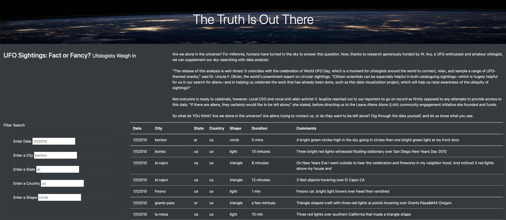
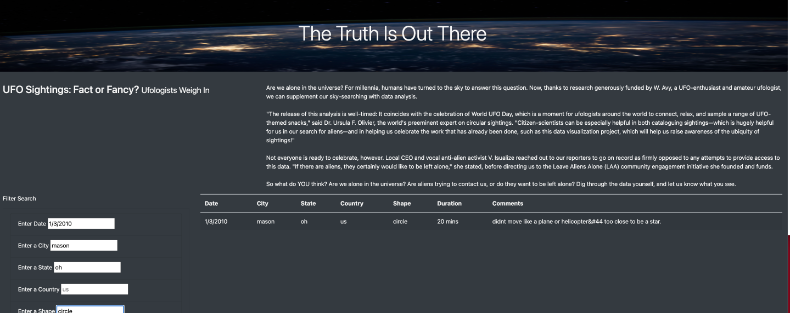

# UFOs

## Overview of the Project

### Purpose

Purpose is to create an interactive webpage that allows readers to parse the data around UFO sightings by building 2 thingss - the webpage that will allow users to view the data (HTML) and a dynamic table that will present the description (Javascript). 

### Initial Analysis

The purpose of the Initial Analysis was to create a webpage with a dynamic table that shows the filetered results of the Ufo sightings data using the date filter. This was done by transforming the array form of data from Data.js dataset to the table in the app_1.js and add filtered to build the filtered table and finally using bootstrap and HTML to build the webpage for the UFO sightings in index.html. 

[app.js](static/js/app_1.js) - The file used to do the inital analysis for the UFO sightings.

[style.css](static/css/style.css) - The css file used to add styles to the UFO sightings webpage.

[data.js](static/js/data.js) - The data file used for the analysis.

### Updated Analysis 

The purpose of the Updated Analysis is allow users to filter the data with more that just date as filter. Additional filters like city,state,country and shape were added to enhance the filter of the UFO sightings data. 

The table was created using JavaScript and HTM/CSS and Bootstrap were used to modify visuals of the website

The files for the updated analysis : 

[app.js](static/js/app.js)

[index.html](index.html)

## Result

With the new updated version,users will be able to filter the data by inputting into one of the filters. The webpage will filter the table to display the filtered data and its descriptions.

The display of the webpage before applying the filters: 

The display of the webpage after the filters bieng applied:

## Summary 

### Drawback

The user must key in specific data related to the date,city,state,country,and shapes to the search to display the relevant data in the table. The filters are case senstive and  cannot include spaces. For example- It will not display the data if we type El cajon instead of el cajon. 

### Recommendations

Recommendations for the further development would be to add a trim function to catch the spaces  as wells as allowing to key upper and lower cases in the filters

Second Recommendations is to add more description options to the table such as Survey form to know the users expirience would be an added benefitial to the website.
